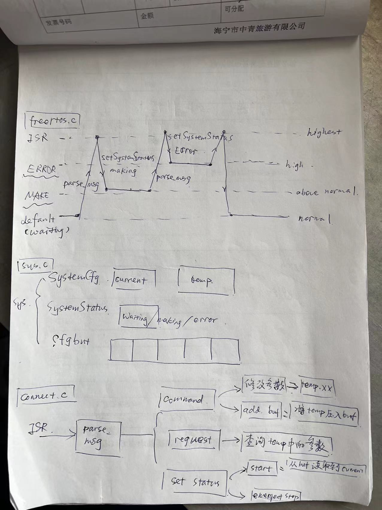
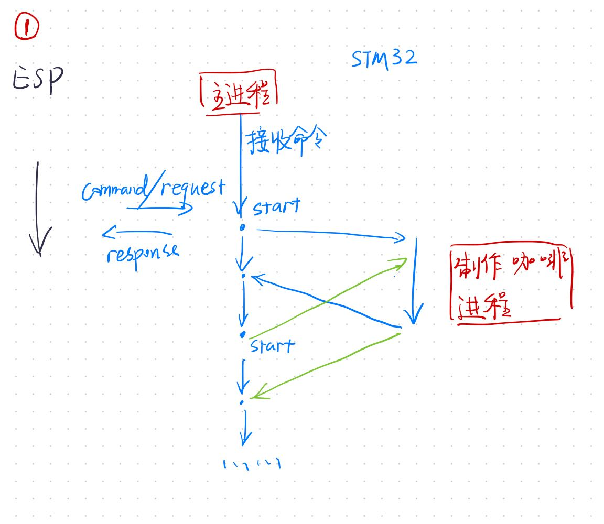
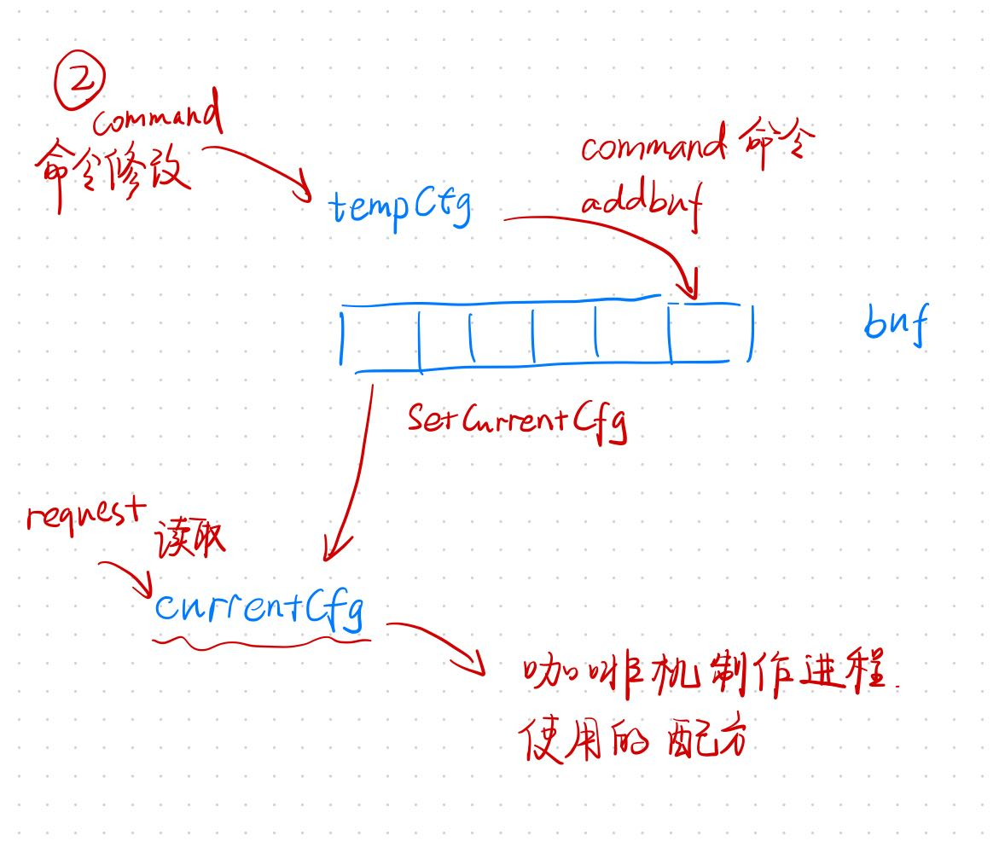

<center><h2>
    STM32咖啡机程序设计说明
    </h2></center>
<center>SMX、SJY、ZY</center>

<h3>
    一、程序原理图
</h3>

- 总的设计思路

  


- 基于三个主要线程——主线程负责esp应答和调度各种系统状态，制作线程负责操控实际控制继电器等。可参考下图




- 接收到的参数命令会立即作用在`tempCfg`变量上，而当命令要求`addbuf`后该变量将会被存储到队列`buf`中。当命令要求执行咖啡制作(`start`)后，会从队列中的读取一个参数，传递给`SystemCurrentCfg`，用于在咖啡制作进程中指导各参数，参考下图




<h3>
    二、通信命令
</h3>

0. ESP32命令发送至STM32

   ```json
   {
       "type": "command",
       "id": 0,
       "command": {
           "variable": "coffee/sugar/milk/temp/addbuf",
           "value": 0
       }
   }
   ```

   其中id字段是为了标识这个命令，要求这个命令和其对应的响应拥有相同的id

   ==增加了addbuf命令==

1. STM32执行命令后向ESP32发送响应

   正常执行命令反馈：

   ```json
   {
       "type": "response",
       "id": 0,
       "result": {
           "status": 0,
           "msg": "command execute succeed"
       }
   }
   ```

   咖啡机处于Making状态时：

   ```json
   {
       "type": "response",
       "id": 0,
       "result": {
           "status": 1,
           "msg": "waiting for finishing"
       }
   }
   ```

   其他的一些异常：例如`buf`饱和

   ```json
   {
       "type": "response",
       "id": 0,
       "result": {
           "status": 2,
           "msg": "..."
       }
   }
   ```

2. ESP32向STM32发送变量获取请求

   ```json
   {
       "type": "request",
       "id": 0,
       "variable": "coffee/..."
   }
   ```

3. STM32回复ESP32的变量请求

   ```json
   {
       "type": "variable",
       "id": 0,
       "result": {
           "variable": "coffee/...",
           "value": 100
       }
   }
   ```

4. 启动与停机命令

   ```json
   {
       "type": "start/emergent stop",
       "id": 0
   }
   ```

5. 启动/停机响应

   ```json
   {
       "type": "status",
       "id": 0,
       "status": "waiting/making/error"
   }
   ```


### 文件结构设计

脚本文件存储在`./stm32/MDK-ARM/coffee-machine/Core/{Inc, Rec}`下，部分文件由cubemx生成，仅做少量修改，我们自定义的文件包括：

- `sensor.h/.c` 定义了传感器读取距离
- `func.h/.c `定义了调用传感器数据、控制搅拌器、控制加热器的函数
- `sys.h/.c `定义了系统状态机
- `connect.h/.c`定义通信
- `main.h/.c`定义主函数
- `freertos.c`定义了项目线程


### 芯片接口功能定义

1. GPIO

|   加料传感器   | 接口 |
| :------------: | :--: |
| coffee_trigger | PC0  |
|  coffee_echo   | PC1  |
|  milk_trigger  | PA1  |
|   milk_echo    | PA2  |
| sugar_trigger  | PA4  |
|   sugar_echo   | PA5  |


|    继电器    | 接口 |
| :----------: | :--: |
| coffee_relay | PB0  |
|  milk_relay  | PB1  |
| sugar_relay  | PB2  |
| heater_relay | PB4  |
| mixer_relay  | PB3  |
|  pour_relay  | PC5  |


2. UART

|         功能         | 接口 | 波特率 |
| :------------------: | :--: | :----: |
| uart2(temp_transmit) | PA2  | 38400  |
| uart2(temp_receive)  | PA3  | 38400  |
| uart3(esp_transmit)  | PB10 | 115200 |
|  uart3(esp_receive)  | PB11 | 115200 |
|      uart1(Tx)       | PA9  | 28800  |
|      uart1(Rx)       | PA10 | 28800  |


----

<div align = right>上次更新时间：2022年8月12日22:03:17</div>


