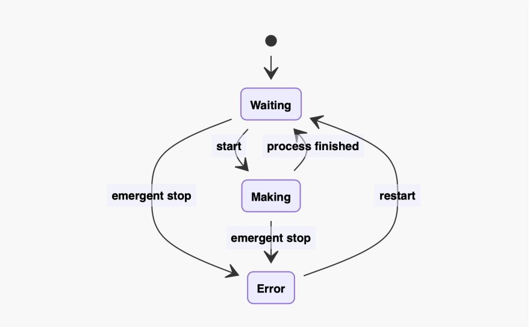
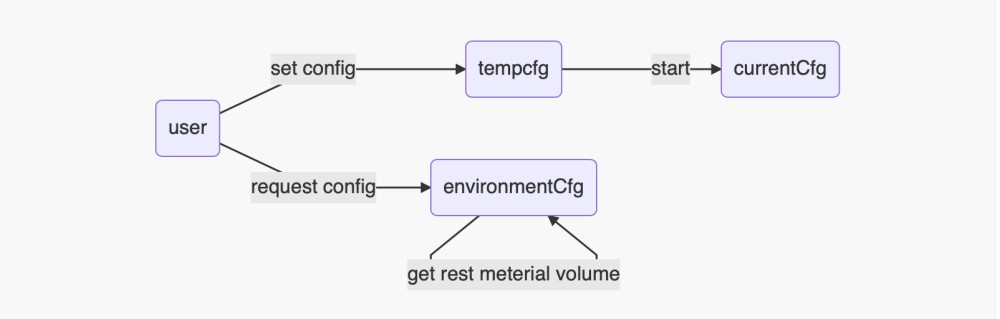
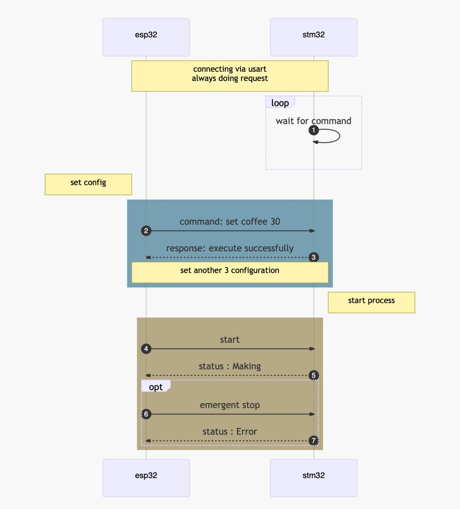
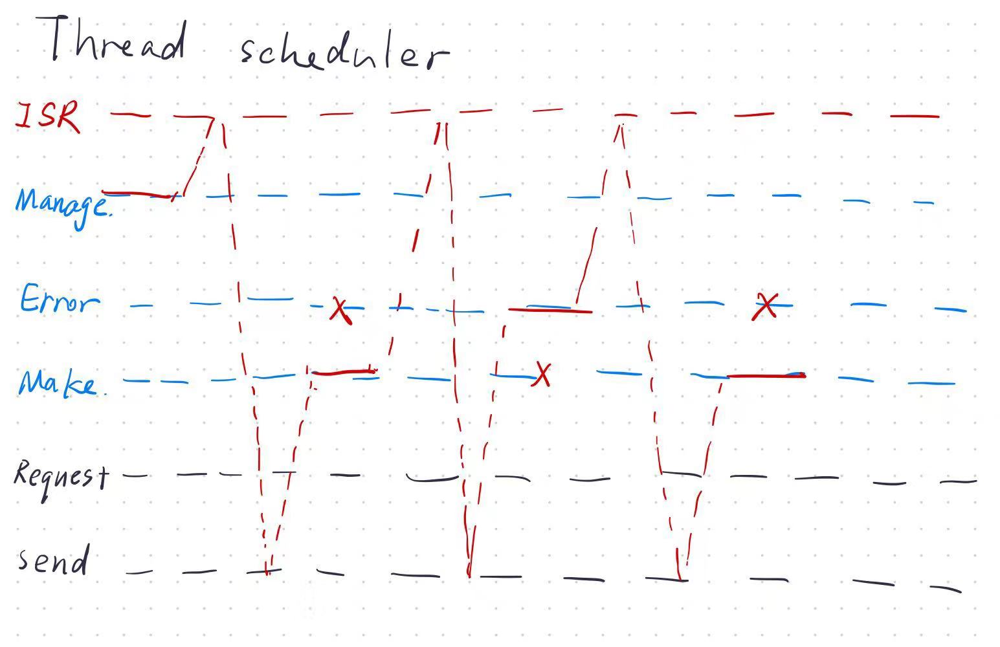
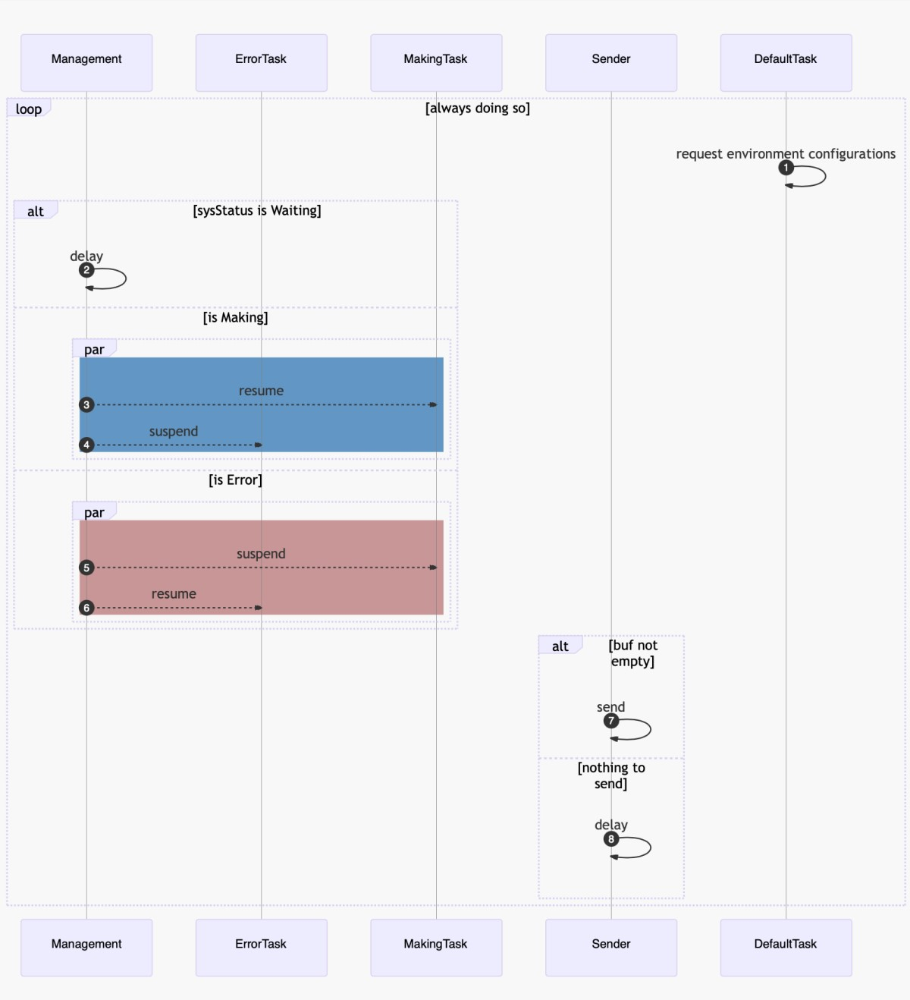

<center><h2>
    STM32咖啡机程序设计说明
    </h2></center>
<center>SMX、SJY、ZY</center>

<h3>
    一、程序原理图
</h3>
- <a id="sys" >系统状态 </a>

在程序中设计有系统状态枚举量SysCurrentCfg用于标定当前的系统状态，并设计相应接口唯一地改变它，防止出现业务逻辑混乱。系统状态改变流程图如下：



- <a id="cfg">参数变化</a>

制作咖啡需要考虑四种参数：咖啡液量、牛奶量、糖量、加热温度。我们将四种参数统一集成为一个结构体类型CoffeeCfg，用来标记一杯咖啡。

为了解决用户在咖啡制作时修改参数带来业务混乱的问题，我们使用了三个CoffeeCfg变量，分别为tempCfg用于响应用户的参数修改，currentCfg用于指导咖啡机制作的用量，environmentCfg用于采集环境参数，例如容器内咖啡的剩余量，以反馈用户。

三个CoffeeCfg之间的关系如下图所示：



- 通信流程

基于cJSON，我们设计了一套用于stm32和esp32的通信标准，对于参数设定、剩余量查询、制作/急停命令，分别定义有command、request、status三种应答模板，不符合标准的应答将会被忽略。



- <a id="freertos">线程管理 </a>

操作系统的核心部分就是多线程的并行执行和调度。基于freeRTOS和对业务逻辑的剖析，我们设计了五条并行线程，各司其职。每个线程都是在各自的无限循环中重复进行相应的工作，通常当一个线程有业务时会处理业务，没有则会进入阻塞式的等待，将CPU让出给其他线程。

在我们的业务逻辑中，CPU中断用于处理接收到的命令；send线程用于发送反馈；default用于轮询传感器，获取液体剩余量。而manage线程用于调度make和error两个子线程，确保工作状态或者紧急停机状态下，这两个子线程中永远只有一个可以工作。

下图是线程调度的流程简化，其中没有标明CPU中断。进程不分先后，标号和上下分布不代表先后次序。

<div>
    
    
</div>
<a id="connect"> </a>

<h3 >
    二、通信命令
</h3>


0. ESP32命令发送至STM32

   ```json
   {
       "type": "command",
       "id": 0,
       "command": {
           "variable": "coffee/sugar/milk/temp",
           "value": 0
       }
   }
   ```

   其中id字段是为了标识这个命令，要求这个命令和其对应的响应拥有相同的id

1. STM32执行命令后向ESP32发送响应

   正常执行命令反馈：

   ```json
   {
       "type": "response",
       "id": 0,
       "result": {
           "status": 0,
           "msg": "command execute succeed"
       }
   }
   ```

   咖啡机处于Making状态时：

   ```json
   {
       "type": "response",
       "id": 0,
       "result": {
           "status": 1,
           "msg": "waiting for finishing"
       }
   }
   ```

   其他的一些异常：例如`buf`饱和

   ```json
   {
       "type": "response",
       "id": 0,
       "result": {
           "status": 2,
           "msg": "..."
       }
   }
   ```

2. ESP32向STM32发送变量获取请求

   ```json
   {
       "type": "request",
       "id": 0,
       "variable": "coffee/..."
   }
   ```

3. STM32回复ESP32的变量请求

   ```json
   {
       "type": "variable",
       "id": 0,
       "result": {
           "variable": "coffee/...",
           "value": 100
       }
   }
   ```

4. 启动与停机命令

   ```json
   {
       "type": "start/emergent stop",
       "id": 0
   }
   ```

5. 启动/停机响应

   ```json
   {
       "type": "status",
       "id": 0,
       "status": "waiting/making/error"
   }
   ```


### 文件结构设计

脚本文件存储在`./stm32/MDK-ARM/coffee-machine/Core/{Inc, Rec}`下，部分文件由cubemx生成，仅做少量修改。

**我们自定义的文件包括**：

- `includes.h`所有头文件的集合
- `sys.h/.c `定义了系统状态机
- `connect.h/.c`定义通信
- `sensor.h/.c` 定义了传感器读取距离
- `tempSensor.h/.c`定义了温度传感器通信的函数
- `Kalman_Filter.h`定义了卡尔曼滤波函数
- `func.h/.c `定义了调用传感器数据、控制搅拌器、控制加热器的函数
- `freertos.c`定义了项目线程

- `cJSON.h/.c`引用cJSON项目，用于与esp32通信


### 芯片接口功能定义

1. GPIO

|   加料传感器   | 接口 |
| :------------: | :--: |
| coffee_trigger | PC0  |
|  coffee_echo   | PC1  |
|  milk_trigger  | PA1  |
|   milk_echo    | PA2  |
| sugar_trigger  | PA4  |
|   sugar_echo   | PA5  |
|  temp_onewire  | PC12 |


|    继电器    | 接口 |
| :----------: | :--: |
| coffee_relay | PB0  |
|  milk_relay  | PB1  |
| sugar_relay  | PD2  |
| heater_relay | PB4  |
| mixer_relay  | PB3  |
|  pour_relay  | PC5  |


2. UART

|        功能         | 接口 | 波特率 |
| :-----------------: | :--: | :----: |
| uart3(esp_transmit) | PB10 | 115200 |
| uart3(esp_receive)  | PB11 | 115200 |
|      uart1(Tx)      | PA9  | 115200 |
|      uart1(Rx)      | PA10 | 115200 |


<h3>中间过程记录</h3>

- 总的设计思路

  


- 基于三个主要线程——主线程负责esp应答和调度各种系统状态，制作线程负责操控实际控制继电器等。可参考下图


- 接收到的参数命令会立即作用在`tempCfg`变量上，而当命令要求`addbuf`后该变量将会被存储到队列`buf`中。当命令要求执行咖啡制作(`start`)后，会从队列中的读取一个参数，传递给`SystemCurrentCfg`，用于在咖啡制作进程中指导各参数，参考下图


<h3>参考</h3>

1. [FreeRTOS](https://github.com/FreeRTOS/FreeRTOS)
2. [cJSON](https://github.com/DaveGamble/cJSON)

----

<div align = right>上次更新时间：2022年9月11日12:32:09</div>


